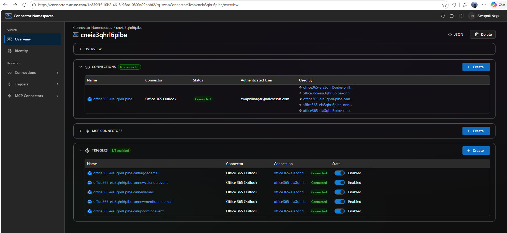

# office365AppPython

Azure Functions sample app demonstrating the **Office 365** connector triggers using Python with rich SDK types.

## Prerequisites

- **Python 3.13** or later
- **azure-functions>=2.2.0b4** (included in requirements.txt)
- **azurefunctions-extensions-connectors** (included in requirements.txt)

## Triggers included

| Function | Type | Description |
|---|---|---|
| `OnNewEmail` | `ClientReceiveMessage` | New email arrives |
| `OnFlaggedEmail` | `GraphClientReceiveMessage` | Email is flagged |
| `OnNewMentionMeEmail` | `GraphClientReceiveMessage` | Email mentions current user |
| `OnNewCalendarEvent` | `GraphCalendarEventClientReceive` | New calendar event created |
| `OnUpcomingEvent` | `GraphCalendarEventClientReceive` | Upcoming event notification |

## Rich SDK Types

This sample uses the `azurefunctions-extensions-connectors` package which provides rich type hints:

```python
import azurefunctions.extensions.connectors.office365 as office365
from typing import List

@app.connector_trigger(arg_name="emails")
def on_new_email(emails: List[office365.ClientReceiveMessage]) -> None:
    for email in emails:
        print(f"Subject: {email.subject}")
        print(f"From: {email.from_}")
```

## Run locally

```bash
pip install -r requirements.txt
func start
```

Update `local.settings.json` with your connector runtime URL and access token before starting.

## Deploy to Azure

`azd up` will provision a Flex Consumption Function App (Python 3.13), a Storage account, Application Insights,
Log Analytics, and a **Connector Namespace** with an Office 365 Outlook connection. After deployment, an
`azd` postdeploy hook (`infra/scripts/postdeploy.ps1` / `.sh`) uses the
[`connector-namespace`](https://github.com/Azure/Connectors) Azure CLI extension to:

1. Create one Connector Namespace **trigger config** per Functions trigger
   in this app, each pointing at the function's connector webhook URL.
2. Walk you through **OAuth consent** for the Office 365 connection by
   opening the consent link in your browser and polling until the
   connection flips to `Connected`.

```bash
azd auth login
azd up
```

The Bash script requires `jq`. The PowerShell script requires PowerShell 7+ (`pwsh`).

> Connector Namespace currently requires the `brazilsouth` region (the only
> region with the required preview features as of writing). Override via
> `azd env set CONNECTOR_NAMESPACE_LOCATION <region>` if needed.

To re-run only the post-deployment configuration without redeploying code:

```bash
azd hooks run postdeploy
```

The connector trigger requires the **Preview** Functions Extension Bundle (`Microsoft.Azure.Functions.ExtensionBundle.Preview`).
This is already configured in `host.json`.

## Verify the Connector Namespace, connection, and triggers

After `azd up` finishes, open the **Connector Namespaces** portal to verify
the resource was provisioned and that all five triggers are wired to a
`Connected` Office 365 connection:

[Connectors — Connector Namespaces](https://connectors.azure.com/)

You should see:

- One **Connection** (Office 365 Outlook) with status **Connected**
- Five **Triggers** (one per function), each in **Enabled** state and bound
  to the connection above



If a trigger is not listed or the connection shows as `Unauthenticated`,
re-run `azd hooks run postdeploy` and complete the consent flow when prompted.

## Project layout

```
office365AppPython/
├── function_app.py           # Python v2 programming model with rich types
├── requirements.txt          # Python dependencies (includes connectors SDK)
├── infra/
│   ├── main.bicep            # azd entrypoint (subscription scope)
│   ├── resources.bicep       # Storage + App Insights + Function App + Connector Namespace
│   ├── connectorNamespace.bicep  # Connector Namespace + Office 365 connection
│   ├── main.parameters.json
│   └── scripts/
│       ├── postdeploy.ps1    # Trigger config + OAuth consent (Windows/pwsh)
│       └── postdeploy.sh     # Trigger config + OAuth consent (POSIX)
├── azure.yaml
├── host.json
└── local.settings.json
```
